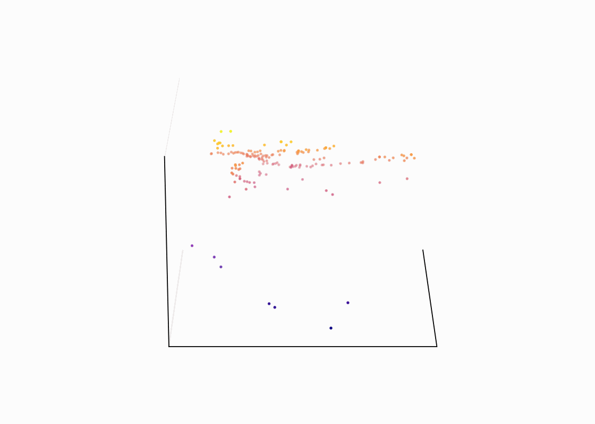
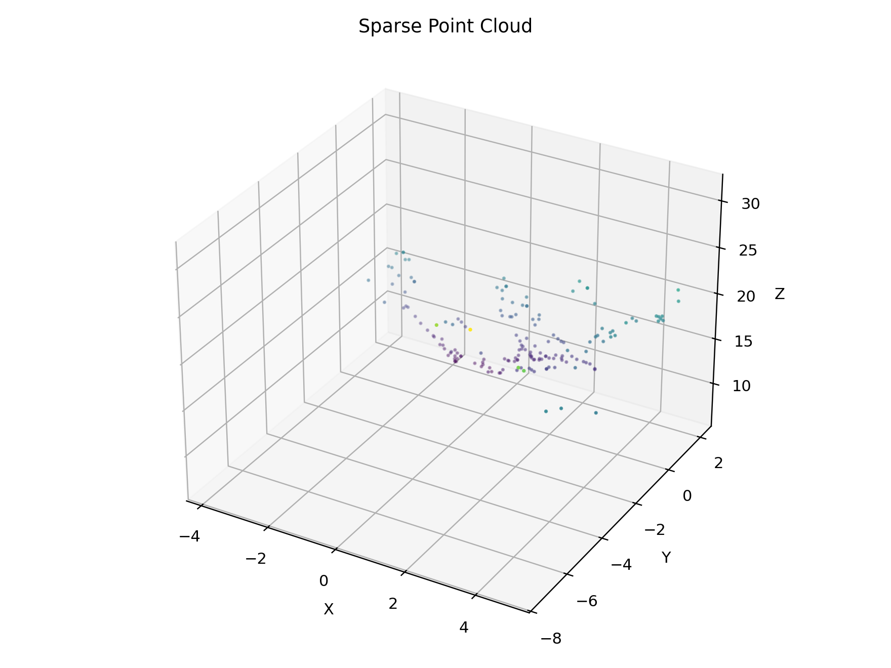
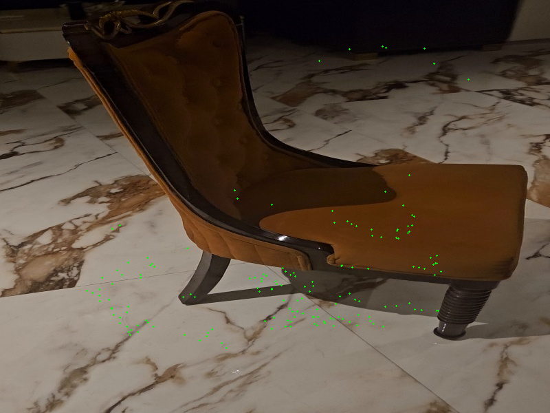

# Multi-Technique 3D Reconstruction from Rotating Video

A Computer Vision project focused on reconstructing sparse 3D point clouds from rotating video sequences using classical OpenCV-based techniques.

## Features
- SIFT feature extraction and feature matching
- Camera pose estimation and triangulation
- Sparse 3D point cloud reconstruction
- Optical flow visualization
- Projection overlay validation
- Object classification using BoVW + SVM

## Tech Stack
Python • OpenCV • NumPy • Matplotlib • Scikit-learn

## Reconstruction Results

### Rotating 3D Point Cloud
Visualization of the reconstructed sparse point cloud generated from rotating viewpoints.



### Sparse Point Cloud Reconstruction
Generated sparse 3D reconstruction from matched feature correspondences.



### Projection Overlay
Projection overlay used to validate reconstruction accuracy and camera alignment.



## Project Structure

```bash
.
├── docs/
├── output/
├── scripts/
├── src/
├── run_full_pipeline.py
└── README.md
```

## Run the Project

### Install Dependencies

```bash
uv sync
```

### Run Full Pipeline

```bash
uv run python run_full_pipeline.py
```

## Future Improvements
- Dense 3D reconstruction
- Real-time reconstruction support
- Deep learning-based feature extraction
- Interactive 3D visualization
- SLAM integration
